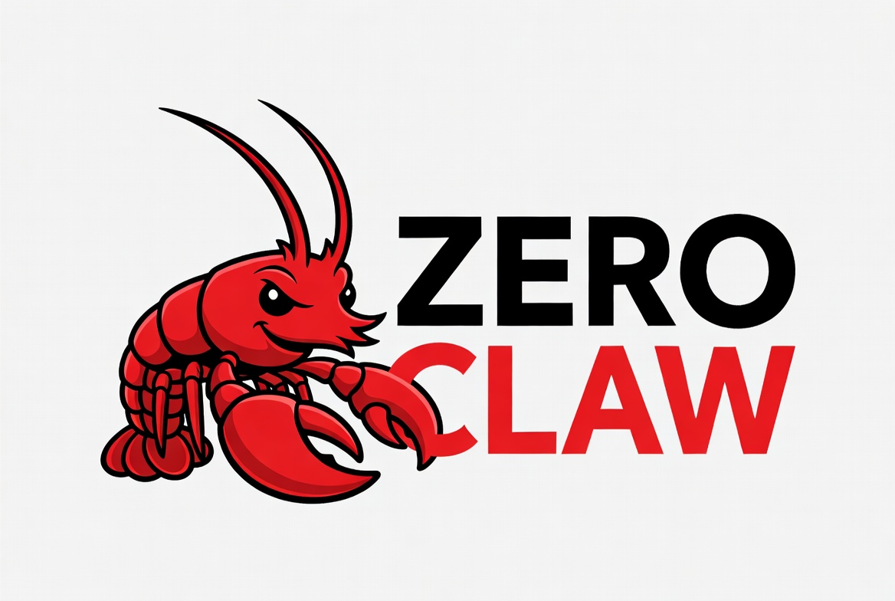

<p align="center">
  
</p>

<p align="center">
  <a href="go.mod"></a>
  <a href="https://github.com/euxaristia/zeroclaw/actions/workflows/ci.yml"></a>
  <a href="LICENSE"></a>
  
  <a href="https://github.com/Gitlawb/zero"></a>
</p>

# zeroclaw 🦞

An autonomous personal agent that lives in its own isolated Linux environment.
[zero](https://github.com/Gitlawb/zero) is the brain; zeroclaw is the body:
a host-side daemon that gives zero a persistent home, an always-on loop,
conversations, schedules, and durable memory.

Prototype. Windows and macOS hosts with Docker Desktop; Linux hosts with
docker or podman.

## How it works ⚙️

```
terminal                   host                        container (zeroclaw-env)
zeroclaw CLI  --RPC-->  zeroclawd daemon  --docker-->  /home/zeroclaw (volume)
                        scheduler, channels,           zero exec, memory,
                        conversation map               skills, workspace
```

- **zeroclawd** is a standalone service. It survives terminal close, owns all
  schedules and channels, and exposes a token-guarded control plane on
  loopback (`~/.zeroclaw/daemon.json`).
- **The CLI is a thin client.** Every command except `up` talks to the daemon
  over RPC. Closing every terminal changes nothing for the agent.
- **Turns run through zero.** Each conversation maps to a zero session inside
  the container, driven over zero's stream-JSON protocol via `docker exec`.
  All zero-specific knowledge lives behind a small driver interface
  (`internal/agent/driver.go`), so the harness is swappable.
- **The volume is the agent.** A named volume mounted at `/home/zeroclaw`
  holds everything: zero config and sessions, memory, skills, workspace. The
  container is disposable.

## Isolation 🔒

Layered, hard boundary first:

1. **The container is the boundary.** No host bind mounts, ever. Files move
   only through explicit `zeroclaw give` and `zeroclaw take` copies.
2. **Zero's own sandbox runs inside** as defense in depth (mode enforce,
   network deny for shell commands, write scoping). Native wrapping is
   degraded under Docker's default security profile because unprivileged user
   namespaces are blocked; we accept that rather than weaken the container
   with extra capabilities.
3. Credentials: `zeroclaw up` copies the host zero provider config and
   encrypted credential store into the volume once. Nothing else from the
   host is visible to the agent.

## Build and run 🚀

Requires Go 1.26+, Docker, and a sibling checkout of zero for the
cross-compiled binary in the image.

```
# from the zero repo: build the linux binaries into zeroclaw's build context
GOOS=linux GOARCH=amd64 CGO_ENABLED=0 go build -o ../zeroclaw/env/bin/zero ./cmd/zero
GOOS=linux GOARCH=amd64 CGO_ENABLED=0 go build -o ../zeroclaw/env/bin/zero-linux-sandbox ./cmd/zero-linux-sandbox

# from this repo
go build -o zeroclaw.exe ./cmd/zeroclaw   # zeroclaw on unix
./zeroclaw.exe up
./zeroclaw.exe chat
```

`up` builds the image on first run, starts the container and the daemon, and
seeds the agent's home with its identity, memory index, and heartbeat files
(`env/bootstrap/`).

## Development 🛠️

Before committing any changes, run all Go code quality and security checks:

1. **Formatting**: Run `go fmt ./...`.
2. **Vetting**: Run `go vet ./...`.
3. **Linting**: Run `golangci-lint run`.
4. **Vulnerability Scan**: Run `govulncheck ./...`.

If `golangci-lint` or `govulncheck` are not installed, install them with:

```bash
# Install golangci-lint
go install github.com/golangci/golangci-lint/cmd/golangci-lint@latest

# Install govulncheck
go install golang.org/x/vuln/cmd/govulncheck@latest
```

Alternatively, you can run them directly without installation using `go run`:

```bash
# Lint via go run
go run github.com/golangci/golangci-lint/v2/cmd/golangci-lint@v2.12.2 run --enable-only unused,ineffassign,staticcheck ./...

# Scan via go run
go run golang.org/x/vuln/cmd/govulncheck@latest ./...
```

## Commands ⌨️

```
zeroclaw up                    start environment + zeroclawd
zeroclaw down                  stop zeroclawd + environment
zeroclaw status                daemon and environment state
zeroclaw chat [conversation]   interactive chat (default: main)
zeroclaw exec "<prompt>"       one turn in the main conversation
zeroclaw beat                  fire a heartbeat turn now
zeroclaw give <file>           copy a host file into the agent's ~/incoming
zeroclaw take <path> [dest]    copy a file out of the agent's home
zeroclaw doctor                diagnose setup
zeroclaw reset-env --force     destroy the environment and the agent's home
zeroclaw daemon run|stop       run zeroclawd in the foreground / stop it
```

## Autonomy and memory 🧠

- A heartbeat fires every 30 minutes by default and follows
  `~/HEARTBEAT.md` inside the agent's home. Configure the interval and add
  interval schedules in `~/.zeroclaw/config.json`:

  ```json
  {
    "heartbeatEvery": "30m",
    "schedules": [
      { "name": "digest", "every": "12h", "prompt": "Summarize ~/incoming and file anything useful." }
    ]
  }
  ```

- The agent keeps its own memory: one file per fact in `~/memory/`, indexed
  in `~/MEMORY.md`, written and recalled without prompting. The identity and
  protocols are seeded from `env/bootstrap/ZEROCLAW.md`.

## Repository layout 📁

```
cmd/zeroclaw/      entrypoint
internal/cli/      thin RPC client commands
internal/daemon/   zeroclawd: control plane, scheduler, launcher
internal/agent/    driver interface, zero stream-JSON driver, conversation map
internal/env/      container lifecycle, give/take, doctor
internal/config/   host config in ~/.zeroclaw
env/               Dockerfile and bootstrap seeds (env/bin is untracked)
AGENTS.md          design, architecture, and guidelines for working on the repo
```

## Status 🗺️

M0 (walking skeleton), M1 (daemon and client split), M2 (scheduler,
heartbeat, memory loop), and M3 (Telegram channel via long polling with a
single-owner chat allowlist) are done. Next: hardening (fallback tier, egress
allowlist, autostart). Details in `AGENTS.md`.
