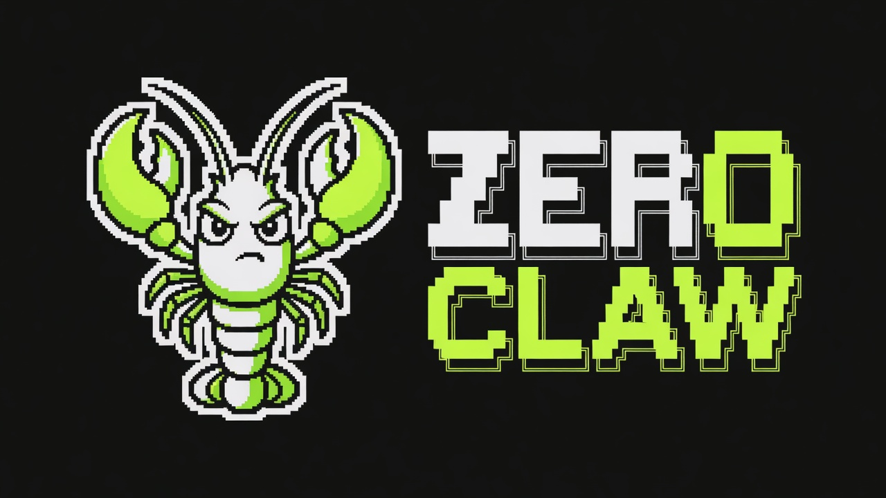

<p align="center">
  
</p>

<p align="center">
  <a href="go.mod"></a>
  <a href="https://github.com/euxaristia/zeroclaw/actions/workflows/ci.yml"></a>
  <a href="LICENSE"></a>
  
  <a href="https://github.com/Gitlawb/zero"></a>
</p>

# zeroclaw 🦞

An autonomous personal agent that lives in its own isolated Linux environment.
[zero](https://github.com/Gitlawb/zero) is the brain; zeroclaw is the body:
a host-side daemon that gives zero a persistent home, an always-on loop,
conversations, schedules, and durable memory.

Prototype. Windows and macOS hosts with Docker Desktop; Linux hosts with
docker or podman.

## How it works ⚙️

```
terminal                   host                        container (zeroclaw-env)
zeroclaw CLI  --RPC-->  zeroclawd daemon  --docker-->  /home/zeroclaw (volume)
                        scheduler, channels,           zero exec, memory,
                        conversation map               skills, workspace
```

- **zeroclawd** is a standalone service. It survives terminal close, owns all
  schedules and channels, and exposes a token-guarded control plane on
  loopback (`~/.zeroclaw/daemon.json`).
- **The CLI is a thin client.** Every command except `up` talks to the daemon
  over RPC. Closing every terminal changes nothing for the agent.
- **Turns run through zero.** Each conversation maps to a zero session inside
  the container, driven over zero's stream-JSON protocol via `docker exec`.
  All zero-specific knowledge lives behind a small driver interface
  (`internal/agent/driver.go`), so the harness is swappable.
- **The volume is the agent.** A named volume mounted at `/home/zeroclaw`
  holds everything: zero config and sessions, memory, skills, workspace. The
  container is disposable.

## Isolation 🔒

Layered, hard boundary first:

1. **The container is the boundary.** No host bind mounts, ever. Files move
   only through explicit `zeroclaw give` and `zeroclaw take` copies.
2. **Zero's own sandbox runs inside** as defense in depth (mode enforce,
   network deny for shell commands, write scoping). Native wrapping is
   degraded under Docker's default security profile because unprivileged user
   namespaces are blocked; we accept that rather than weaken the container
   with extra capabilities.
3. Credentials: `zeroclaw up` copies the host zero provider config and
   encrypted credential store into the volume once. Nothing else from the
   host is visible to the agent.

## Build and run 🚀

Requires Go 1.26+, Docker, and a sibling checkout of zero for the
cross-compiled binary in the image.

```
# from the zero repo: build the linux binaries into zeroclaw's build context
GOOS=linux GOARCH=amd64 CGO_ENABLED=0 go build -o ../zeroclaw/env/bin/zero ./cmd/zero
GOOS=linux GOARCH=amd64 CGO_ENABLED=0 go build -o ../zeroclaw/env/bin/zero-linux-sandbox ./cmd/zero-linux-sandbox

# from this repo
go build -o zeroclaw.exe ./cmd/zeroclaw   # zeroclaw on unix
./zeroclaw.exe up
./zeroclaw.exe web
```

`up` builds the image on first run, starts the container and the daemon, and
seeds the agent's home with its identity, memory index, and heartbeat files
(`env/bootstrap/`).

The web UI (`web/`) is built with [Bun](https://bun.sh) (no npm) and its
output is committed to `internal/daemon/webdist/` and embedded into the
`zeroclaw` binary, so a bare clone builds and runs `zeroclaw web` without
Bun installed. Only rebuild it when changing `web/` itself:

```
cd web && bun install && bun run build   # regenerates internal/daemon/webdist
```

For UI iteration, set `ZEROCLAW_WEB_DIR` before starting the daemon and it
serves straight off disk instead of the embedded build, so `bun run build` +
a browser refresh is enough, no daemon restart:

```
ZEROCLAW_WEB_DIR="$(pwd)/internal/daemon/webdist" ./zeroclaw.exe up
```

The daemon otherwise binds an OS-assigned port, so every restart moves it
and an open tab goes stale. `ZEROCLAW_PORT` pins it, which matters when a
change is Go-side and does need a restart (`ZEROCLAW_WEB_DIR` only hot-serves
frontend assets, never the binary):

```
ZEROCLAW_PORT=8787 ZEROCLAW_WEB_DIR="$(pwd)/internal/daemon/webdist" ./zeroclaw.exe up
```

The bearer token is still regenerated on each start, so re-run
`zeroclaw web` after a restart to get a working URL.

The frontend has its own checks, run from `web/`:

```
bun test         # markdown renderer, context gauge
bun run typecheck
```

The Go module is stdlib-only: `go.mod` has no `require` block, and there is
no `go.sum`. The browser is the only interactive surface, so nothing pulls
in a terminal UI toolkit.

## Web UI 🌐

`zeroclaw web` prints and opens a loopback URL carrying the daemon's bearer
token. The page stores the token in `sessionStorage`, strips it from the URL
bar, and from then on talks to the same `/status`, `/turn`, `/models`,
`/providers`, and `/conversations` endpoints the CLI uses. It is a peer
client of the CLI and Telegram, with no privileged path into the agent.

- **Chat** with streaming replies rendered as markdown (fenced code,
  headings, lists, links). Reasoning, tool calls, and tool results are shown
  distinctly.
- **Stop** cancels a running turn. This is a real cancellation: the daemon
  hands its request context to the driver, so dropping the connection kills
  the in-container process.
- **Slash commands**, with a palette that opens on `/` and narrows as you
  type: `/model`, `/provider`, `/conversation`, `/theme`, and `/effort` open
  filterable pickers; `/new`, `/retry`, `/copy`, `/export`, `/beat`,
  `/turns`, `/status`, `/help`, and `/clear` act directly.
- **Esc cancels** a running turn, with a confirmation press, as in zero.
- **Input history** with Up/Down and a position indicator.
- **Per-conversation transcripts**, restored on refresh. Each conversation
  is a separate zero session, so each keeps its own visible history.

State lives in `sessionStorage`: it survives a refresh and clears when the
tab closes. The daemon picks a fresh port and token on every restart, so
re-run `zeroclaw web` after `zeroclaw up`.

## Development 🛠️

Run these four checks before every commit. CI gates on them (see
`.github/workflows/ci.yml`): `gofmt -l .` must report nothing, `go vet ./...`
and `go test ./...` must pass, and `golangci-lint` is an advisory gate.

```bash
go fmt ./...      # must report no changes (rewrites files in place)
go vet ./...      # must pass
go test ./...     # must pass
go run github.com/golangci/golangci-lint/v2/cmd/golangci-lint@v2.12.2 run --enable-only unused,ineffassign,staticcheck ./...
```

`go fmt` rewrites files, so run it, review the diff, then commit. The linter
pinned version must match CI (currently v2.12.2).

Periodically (and before releases), scan for known vulnerabilities in the
toolchain and standard library, using the same version CI pins:

```bash
go run golang.org/x/vuln/cmd/govulncheck@v1.3.0 ./...
```

The module is stdlib-only, so findings can only come from the Go standard
library or the toolchain itself; fix by bumping the Go version.

If `go run` can't fetch these modules (e.g. no network access), install them
locally instead, pinned to the same versions CI uses:

```bash
go install github.com/golangci/golangci-lint/v2/cmd/golangci-lint@v2.12.2
go install golang.org/x/vuln/cmd/govulncheck@v1.3.0
```

## Commands ⌨️

```
zeroclaw [-a <agent>] list      list all available zeroclaw agent profiles and status
zeroclaw [-a <agent>] up        start environment + zeroclawd
zeroclaw [-a <agent>] down      stop zeroclawd + environment
zeroclaw [-a <agent>] status    daemon and environment state
zeroclaw [-a <agent>] web       open the web UI in a browser
zeroclaw [-a <agent>] chat      alias for web
zeroclaw [-a <agent>] exec "<p>" one turn in the main conversation
zeroclaw race "<prompt>"        benchmark a prompt across multiple zero sessions
zeroclaw visualizer [--watch]   live TUI dashboard of container, daemon & security metrics
zeroclaw audit                  run automated security scorecard diagnostics
zeroclaw [-a <agent>] beat      fire a heartbeat turn now
zeroclaw [-a <agent>] give <f>  copy a host file into the agent's ~/incoming
zeroclaw [-a <agent>] take <p>  copy a file out of the agent's home
zeroclaw [-a <agent>] doctor    diagnose setup
zeroclaw [-a <agent>] auth      manage container zero auth (interactive login or sync host credentials)
zeroclaw [-a <agent>] reset-container remove disposable container (preserves volume & home data)
zeroclaw [-a <agent>] reset-env --force destroy the environment and the agent's home
zeroclaw [-a <agent>] daemon start|run|stop start, run in foreground, or stop zeroclawd
```

## Autonomy and memory 🧠

- A heartbeat fires every 30 minutes by default and follows
  `~/HEARTBEAT.md` inside the agent's home. Configure the interval and add
  interval schedules in `~/.zeroclaw/config.json`:

  ```json
  {
    "heartbeatEvery": "30m",
    "schedules": [
      { "name": "digest", "every": "12h", "prompt": "Summarize ~/incoming and file anything useful." }
    ]
  }
  ```

- The agent keeps its own memory: one file per fact in `~/memory/`, indexed
  in `~/MEMORY.md`, written and recalled without prompting. The identity and
  protocols are seeded from `env/bootstrap/ZEROCLAW.md`.

## Repository layout 📁

```
cmd/zeroclaw/      entrypoint
internal/cli/      thin RPC client commands
internal/daemon/   zeroclawd: control plane, scheduler, launcher
internal/agent/    driver interface, zero stream-JSON driver, conversation map
internal/env/      container lifecycle, give/take, doctor
internal/config/   host config in ~/.zeroclaw
web/               web UI source (Bun/TypeScript), built into internal/daemon/webdist
env/               Dockerfile and bootstrap seeds (env/bin is untracked)
AGENTS.md          design, architecture, and guidelines for working on the repo
```

## Status 🗺️

M0 (walking skeleton), M1 (daemon and client split), M2 (scheduler,
heartbeat, memory loop), M3 (Telegram channel via long polling with a
single-owner chat allowlist), and M4 (web UI, `zeroclaw web`) are done. Next:
hardening (fallback tier, egress allowlist, autostart). Details in
`AGENTS.md`.

Known web UI limits: state is per browser tab (`sessionStorage`), the
transcript is a local record rather than a replay of the agent's session
history, and a daemon restart invalidates an open tab's port and token.
